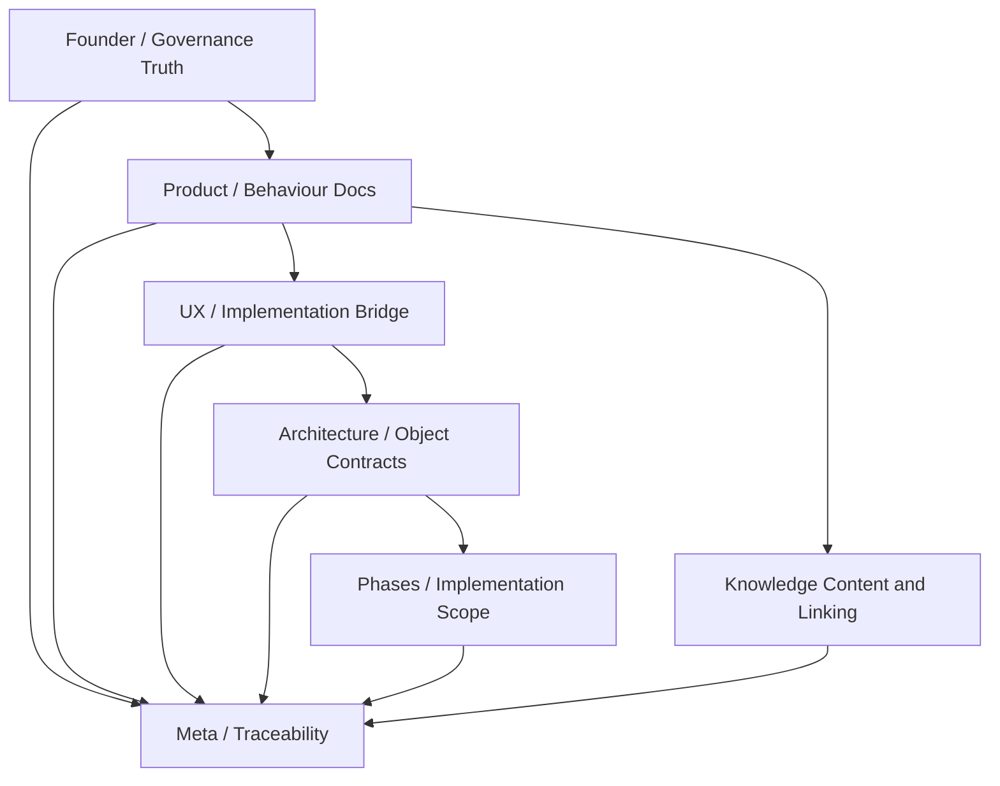
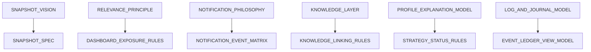
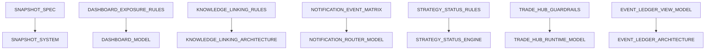
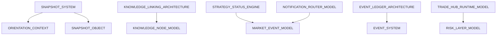

# DEPENDENCY_MAP.md

## Purpose
Shows the dependency graph across the PocketPilot documentation stack.

## 1. Core dependency idea
Every lower-level doc should be able to answer:
- what upstream rule authorizes me?
- what downstream docs or systems consume me?

## 2. High-level dependency flow

## 3. Product-to-UX dependency map

## 4. UX-to-architecture dependency map

## 5. Architecture-to-contract dependency map

## 6. Review rule
A doc with no visible parent or child should be treated as suspicious until its place is clear.

## 7. Anti-patterns to block
- sideways duplicate docs claiming the same job
- architecture docs with no object contracts or consumers
- object contracts with no consumer
- surface specs that bypass product behavior
